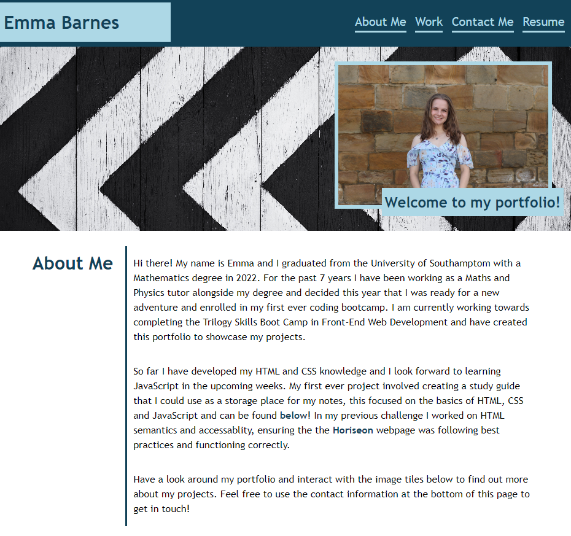
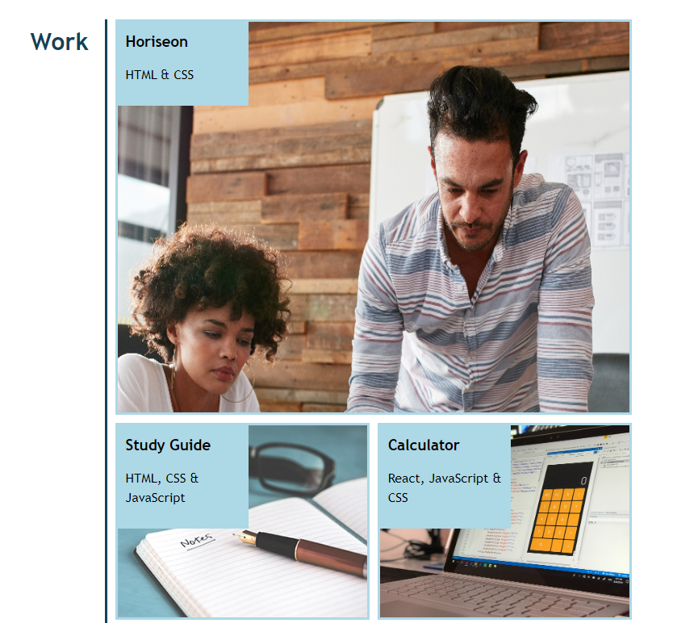
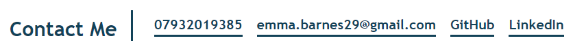

# Module 2 Challenge - Portfolio

## Description
As I have been developing my HTML and CSS skills, I wanted to create a portfolio which showcases my applications and provides some more information about me, my work and how to contact me. I wanted to put this week's learning into practice and explore CSS Flexboxes, Grids and Media Queries to make my page responsive and more interactive for the user. This webpage is a great starting point for my portfolio which I can further improve and update as I delve deeper into the bootcamp.

Building this webpage was an amazing learning experience as I had to build the majority of the code myself and experimented with using Flexboxes, Grids and Media Queries for the first time. My webpage design improved while working on this project and I added small elements, like hover, to add some interactivity to the page. Additionally, I learnt about making the page responsive to different viewport sizes by using media queries to resize elements at different breaking points. 

## Installation

N/A

## Usage

To access this webpage, please use the following URL: 

My portfolio provides information about my background, links to my deployed applications (which will be updated over the coming weeks) and how to contact me. Try using the navigation bar to navigate to each section of the webpage and click on the images in my work section to be taken to the deployed application!

## Credits

N/A

## License

Please refer to LICENSE in repo.
